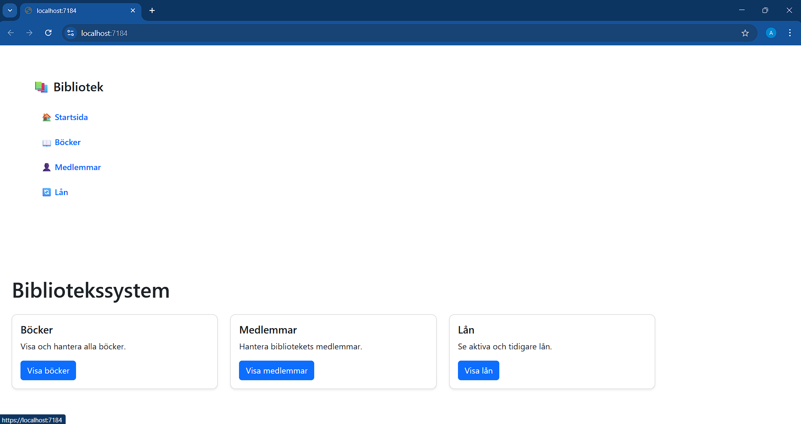
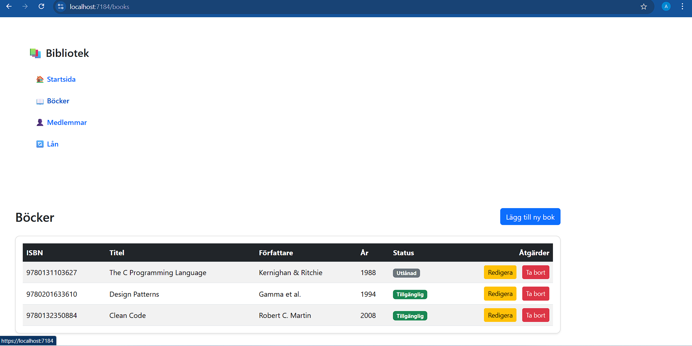
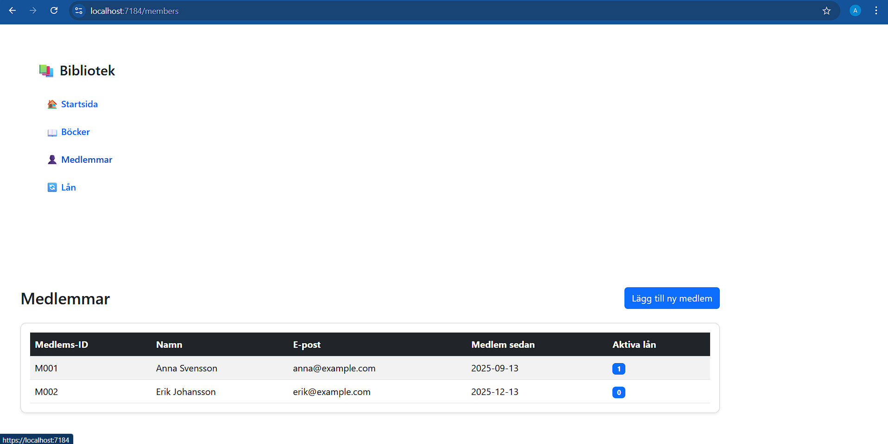
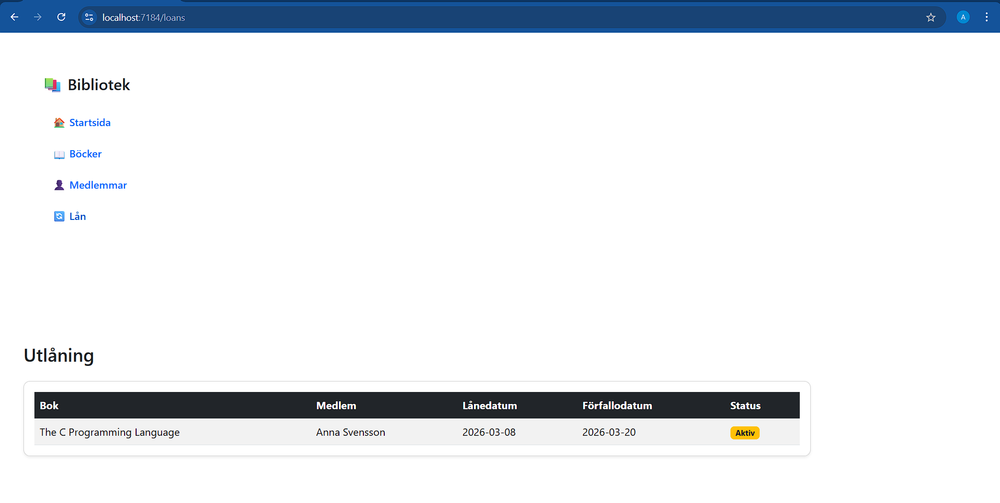

# LibrarySystem – Blazor & Entity Framework

## Beskrivning
Detta projekt är ett enkelt bibliotekssystem utvecklat i **C# med Blazor och Entity Framework Core**.

Applikationen gör det möjligt att hantera:

- Böcker
- Medlemmar
- Utlåning

Systemet använder **Entity Framework Core** för databasåtkomst och **Blazor** för användargränssnittet.

Projektet är uppdelat i flera lager:

- **LibrarySystem.Core** – Domänmodeller
- **LibrarySystem.Data** – DbContext och databaslogik
- **LibrarySystem.Web** – Blazor-applikationen
- **LibrarySystem.Tests** – xUnit-tester

---

# Blazor-sidor

Applikationen innehåller minst tre funktionella Blazor-sidor:

- **Books** – hantera böcker
- **Members** – visa och lägga till medlemmar
- **Loans** – visa utlånade böcker

---

# Funktionalitet

### Böcker (CRUD)
- Visa alla böcker
- Lägga till ny bok
- Redigera bok
- Ta bort bok

### Medlemmar
- Visa alla medlemmar
- Lägga till ny medlem
- Se antal aktiva lån

### Utlåning
- Visa aktiva lån
- Visa försenade lån
- Visa returnerade böcker

---

# Tekniker som används

Projektet använder:

- **C#**
- **Blazor**
- **Entity Framework Core**
- **xUnit**
- **Bootstrap**

---

# Hur man kör projektet

1. Klona repositoryt

2. Öppna lösningen i **Visual Studio**

3. Starta projektet:

4. Applikationen startar i webbläsaren.

---

# Databas

Applikationen använder **Entity Framework Core** med en **DbContext (LibraryContext)** för att hantera databasen.

Data sparas och hämtas från databasen via Entity Framework.

---

# Databasmodell

Applikationen använder tre huvudtabeller:

## Book

| Fält | Beskrivning |
|-----|-------------|
| Id | Primärnyckel |
| ISBN | Boknummer |
| Title | Titel |
| Author | Författare |
| PublishedYear | Utgivningsår |
| IsAvailable | Om boken är tillgänglig |

## Member

| Fält | Beskrivning |
|-----|-------------|
| Id | Primärnyckel |
| MemberId | Medlemsnummer |
| Name | Namn |
| Email | E-post |
| MemberSince | Registreringsdatum |

## Loan

| Fält | Beskrivning |
|-----|-------------|
| Id | Primärnyckel |
| BookId | Referens till bok |
| MemberId | Referens till medlem |
| LoanDate | Lånedatum |
| DueDate | Förfallodatum |
| ReturnDate | Returdatum |

---

# Databasschema

Relationer mellan tabeller:

- En bok kan lånas flera gånger
- En medlem kan ha flera lån

---

# Testning

Projektet innehåller **xUnit-tester**.

Testerna testar bland annat:

- Skapa bok
- Hämta böcker
- Uppdatera bok
- Ta bort bok
- Skapa medlem
- Skapa lån
- Uppdatera lån

Totalt finns **minst 10 enhetstester**.

Kör tester med:

dotnet test

Alla tester passerar.

---

# Screenshots

